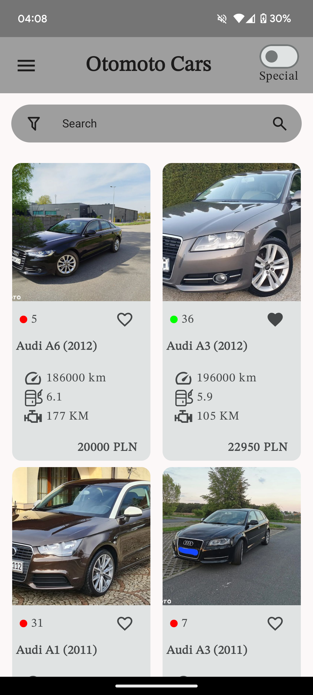
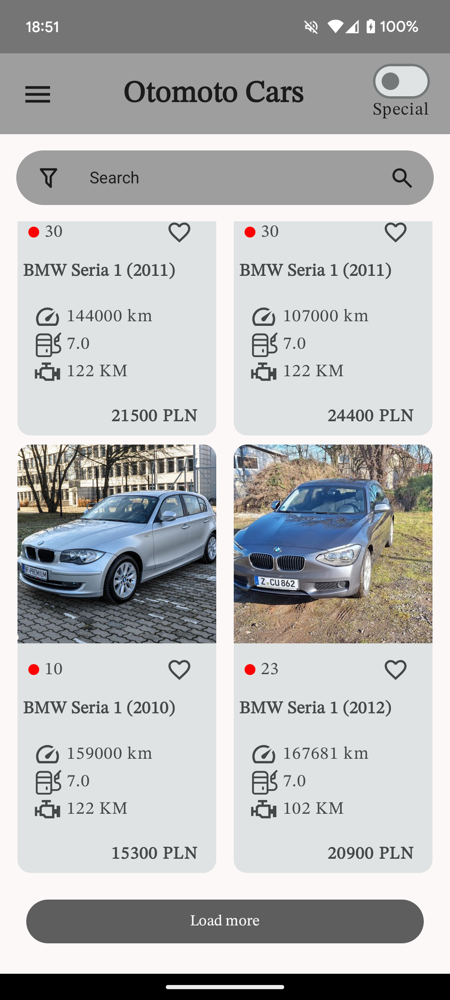
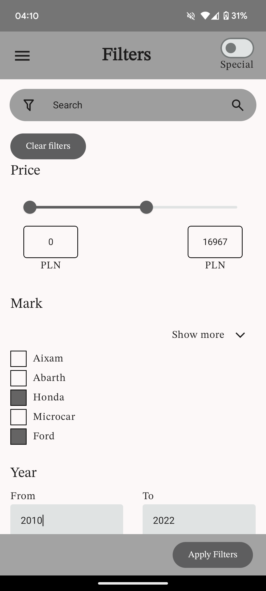
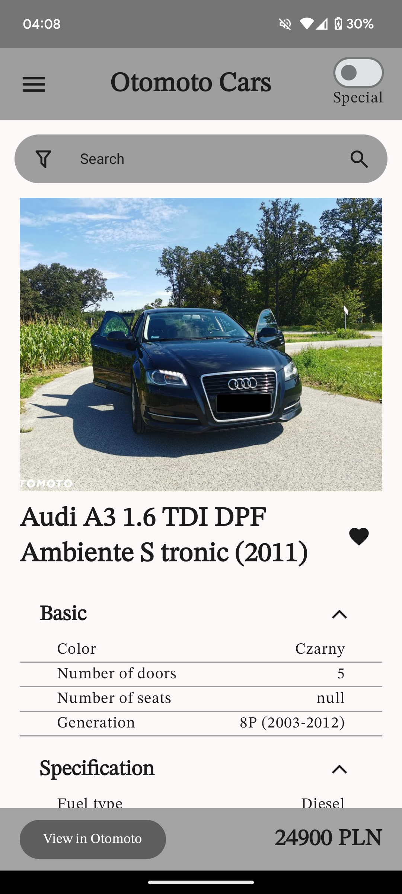
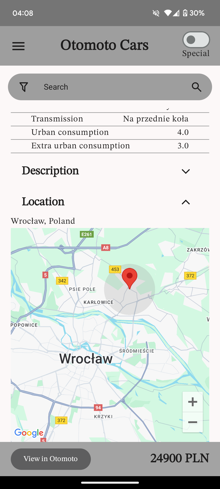
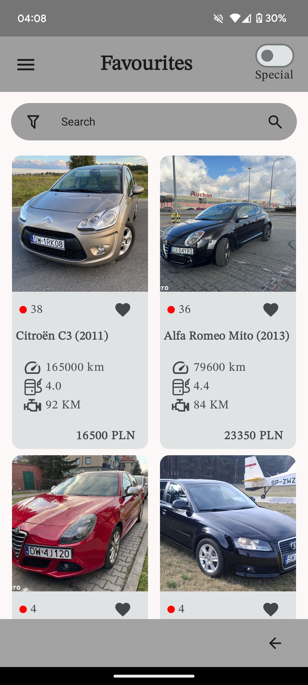

# Otomoto Cars

Otomoto Cars is a used-car market tracking project built around Otomoto listings. It collects offers, stores historical market data, exposes that data through an API, and provides an Android app for browsing, filtering, and saving interesting cars.

The current active stack is:

- `CarMarketAnalyzer` - Java Spring Boot backend, scraper, REST API, and scraper-control UI.
- `otomoto-app/OtomotoApp` - Kotlin Android app.
- `legacy-python` - old Python scraper and FastAPI server, kept only for reference.

## Demo

Video demo:

[Video Demo](https://youtube.com/shorts/px98Wrb-iyE?feature=share)

Demo APK with mock data:

[Download APK with test data](https://github.com/kkateryna06/Otomoto/releases/tag/v1.0-demo)

The demo APK uses bundled mock data, so only limited features are available. The full app experience requires the Spring Boot backend.

<table>
  <tr>
    <td align="center">
      <br/>
      <b>Main Screen</b>
    </td>
    <td align="center">
      <br/>
      <b>Main Screen 2</b>
    </td>
    <td align="center">
      <br/>
      <b>Filters Screen</b>
    </td>
  </tr>
  <tr>
    <td align="center">
      <br/>
      <b>Details Screen</b>
    </td>
    <td align="center">
      <br/>
      <b>Details Screen 2</b>
    </td>
    <td align="center">
      <br/>
      <b>Favourites Screen</b>
    </td>
  </tr>
</table>

## Repository Structure

```text
CarMarketAnalyzer/          Active Java Spring Boot backend and scraper
otomoto-app/OtomotoApp/     Active Android mobile app
legacy-python/              Old Python scraper and FastAPI server, legacy only
screenshots/                App screenshots used in this README
```

## Backend: CarMarketAnalyzer

`CarMarketAnalyzer` is the current backend and scraper. It collects listings from `otomoto.pl`, stores them in PostgreSQL, serves the data through REST endpoints, and provides a local browser UI for scraper control.

Main capabilities:

- Scrapes Otomoto search result pages from a configurable search URL.
- Finds listing links containing `/oferta/`.
- Opens each listing and parses data from `script#__NEXT_DATA__`.
- Stores cars in PostgreSQL in the `cars_info` table.
- Updates existing rows by listing URL instead of inserting duplicates.
- Tracks `currentPrice` and JSON `priceHistory`.
- Adds a price-history entry only when the price changes.
- Stores all remote photo URLs and downloads a limited number of local photos.
- Rechecks already stored active listings directly by URL.
- Marks a listing inactive only after 2 confirmed `404` or `410` responses.
- Keeps listings active on temporary/inconclusive errors such as `403`, `429`, `5xx`, timeout, or missing `__NEXT_DATA__`.
- Supports manual scraping, manual rechecks, interval schedules, and daily schedules.

Tech stack:

- Java 21
- Spring Boot
- Spring Web MVC
- Spring Data JPA / Hibernate
- PostgreSQL
- jsoup
- Lombok
- Gradle

## Backend Setup

Create a PostgreSQL database:

```sql
CREATE DATABASE otomoto;
```

Database settings are read from `CarMarketAnalyzer/src/main/resources/application.properties` and can be overridden with environment variables:

```properties
spring.datasource.url=${DB_URL:jdbc:postgresql://localhost:5432/otomoto}
spring.datasource.username=${DB_USERNAME:postgres}
spring.datasource.password=${DB_PASSWORD:}
spring.jpa.hibernate.ddl-auto=update
```

PowerShell example:

```powershell
$env:DB_URL="jdbc:postgresql://localhost:5432/otomoto"
$env:DB_USERNAME="postgres"
$env:DB_PASSWORD="your-local-password"
```

Run the backend:

```powershell
cd CarMarketAnalyzer
.\gradlew.bat bootRun
```

Backend URL:

```text
http://localhost:8080
```

Scraper browser UI:

```text
http://localhost:8080/
```

## Scraper UI

The browser UI is the easiest way to control the scraper locally.

It allows you to:

- Set the Otomoto `Search URL`.
- Set `Max recheck listings per run`.
- Start a scrape manually.
- Start a direct recheck manually.
- Enable interval or daily schedules for scraping.
- Enable interval or daily schedules for rechecks.
- Disable schedules.
- View scraper status, next run times, last run result, and stored car count.

Typical workflow:

1. Start the backend.
2. Open `http://localhost:8080/`.
3. Paste an Otomoto search URL into `Search URL`.
4. Set `Max recheck listings per run`.
5. Click `Save Settings`.
6. Click `Run Scrape`.
7. Watch `Last result`, `Next run`, `Next recheck`, and `Cars`.
8. Use `Recheck Listings` when you only want to update prices and actuality for already saved listings.

## REST API

Base URL:

```text
http://localhost:8080
```

### Scraper API

#### Start Scrape

```http
GET /api/scraper/scrape
```

Starts scraping in a background thread. If the scraper is already running, the endpoint returns:

```text
Scraper is already running.
```

#### Start Recheck

```http
GET /api/scraper/recheck
```

Starts a direct recheck of stored active listings without reading the search page.

#### Get Scraper Status

```http
GET /api/scraper/status
```

Returns scraper state and schedule metadata.

Response fields include:

- `running`
- `scheduleEnabled`
- `scheduleMode`
- `intervalMinutes`
- `timeOfDay`
- `recheckScheduleEnabled`
- `recheckScheduleMode`
- `recheckIntervalMinutes`
- `recheckTimeOfDay`
- `searchUrl`
- `lastSearchUrl`
- `nextRunAt`
- `recheckNextRunAt`
- `lastStartedAt`
- `lastFinishedAt`
- `lastTrigger`
- `lastResult`

Example `lastResult`:

```text
Completed: found 45, saved 43, errors 2
```

#### Get Scraper Settings

```http
GET /api/scraper/settings
```

Example response:

```json
{
  "searchUrl": "https://www.otomoto.pl/osobowe",
  "maxRecheckListingsPerRun": 100
}
```

#### Update Scraper Settings

```http
PUT /api/scraper/settings
Content-Type: application/json

{
  "searchUrl": "https://www.otomoto.pl/osobowe/bmw",
  "maxRecheckListingsPerRun": 100
}
```

Validation:

- `searchUrl` must use `https`.
- Host must be `otomoto.pl` or a subdomain of `otomoto.pl`.
- Path must start with `/osobowe`.
- `maxRecheckListingsPerRun` must be between 1 and 1000.

#### Configure Scrape Schedule

Enable interval scraping:

```http
POST /api/scraper/schedule
Content-Type: application/json

{
  "enabled": true,
  "intervalMinutes": 60
}
```

Enable daily scraping:

```http
POST /api/scraper/schedule
Content-Type: application/json

{
  "enabled": true,
  "timeOfDay": "03:00"
}
```

Disable scheduled scraping:

```http
POST /api/scraper/schedule
Content-Type: application/json

{
  "enabled": false
}
```

#### Configure Recheck Schedule

Enable interval rechecks:

```http
POST /api/scraper/recheck/schedule
Content-Type: application/json

{
  "enabled": true,
  "intervalMinutes": 180
}
```

Enable daily rechecks:

```http
POST /api/scraper/recheck/schedule
Content-Type: application/json

{
  "enabled": true,
  "timeOfDay": "06:00"
}
```

Disable scheduled rechecks:

```http
POST /api/scraper/recheck/schedule
Content-Type: application/json

{
  "enabled": false
}
```

### Cars API

#### Endpoint Summary

```http
GET    /api/cars
GET    /api/cars?page=0&size=20
GET    /api/cars/{id}
GET    /api/cars/count
GET    /api/cars/brands
GET    /api/cars/models?brand=Audi
GET    /api/cars/fuel-types
GET    /api/cars/body-types
GET    /api/cars/gearboxes
GET    /api/cars/transmissions
POST   /api/cars
DELETE /api/cars/{id}
```

#### List Cars

```http
GET /api/cars
```

Without query parameters, this returns all cars for compatibility. For normal use, prefer pagination:

```http
GET /api/cars?page=0&size=20
```

Pagination rules:

- `page` is zero-based.
- `size` must be between 1 and 100.
- Any filter parameter switches the response to a Spring Page response.

Supported filters:

| Parameter | Example |
| --- | --- |
| `q` | `q=audi` |
| `brand`, `model`, `fuelType`, `bodyType`, `gearbox`, `transmission`, `sellerType` | `brand=Audi&brand=BMW` |
| `minYear`, `maxYear` | `minYear=2018&maxYear=2024` |
| `minMileage`, `maxMileage` | `maxMileage=120000` |
| `minPrice`, `maxPrice` | `minPrice=20000&maxPrice=60000` |
| `minEngineCapacity`, `maxEngineCapacity` | `minEngineCapacity=1400` |
| `minEnginePower`, `maxEnginePower` | `minEnginePower=100` |
| `actual` | `actual=true` |
| `postedFrom`, `postedTo` | `postedFrom=2026-06-01T00:00:00Z` |
| `sortBy`, `sortDirection` | `sortBy=year&sortDirection=desc` |

Allowed `sortBy` values:

```text
id, brand, model, year, mileage, currentPrice,
engineCapacity, enginePower, postedAt, lastSeenAt, lastCheckedAt
```

Text filters are case-insensitive.

Examples:

```bash
curl http://localhost:8080/api/cars/count
curl "http://localhost:8080/api/cars?page=0&size=20"
curl "http://localhost:8080/api/cars?page=0&size=20&brand=Audi&minYear=2018&maxPrice=60000&actual=true&sortBy=currentPrice&sortDirection=asc"
curl http://localhost:8080/api/cars/brands
curl "http://localhost:8080/api/cars/models?brand=Audi"
curl http://localhost:8080/api/cars/1
```

#### Get Car By ID

```http
GET /api/cars/{id}
```

Returns a single car by internal database ID.

#### Count Cars

```http
GET /api/cars/count
```

Returns the number of stored cars.

#### Dictionary Endpoints

These endpoints return values useful for app filters:

```http
GET /api/cars/brands
GET /api/cars/models?brand=Audi
GET /api/cars/fuel-types
GET /api/cars/body-types
GET /api/cars/gearboxes
GET /api/cars/transmissions
```

#### Add Car Manually

```http
POST /api/cars
Content-Type: application/json

{
  "brand": "BMW",
  "model": "320i",
  "year": 2020,
  "mileage": 50000,
  "fuelType": "petrol",
  "engineCapacity": 2000,
  "bodyType": "sedan",
  "gearbox": "automatic",
  "url": "https://example.com/car",
  "description": "Manual entry"
}
```

Equivalent curl:

```bash
curl -X POST http://localhost:8080/api/cars \
  -H "Content-Type: application/json" \
  -d '{
    "brand": "BMW",
    "model": "320i",
    "year": 2020,
    "mileage": 50000,
    "fuelType": "petrol",
    "engineCapacity": 2000,
    "bodyType": "sedan",
    "gearbox": "automatic",
    "url": "https://example.com/car",
    "description": "Manual entry"
  }'
```

#### Delete Car

```http
DELETE /api/cars/{id}
```

Example:

```bash
curl -X DELETE http://localhost:8080/api/cars/1
```

### Photos API

Local photos are served by Spring through:

```text
/photos/**
```

The scraper separates remote links from local files:

- `photoUrls` stores all image URLs found in the Otomoto listing JSON.
- `localPhotoPaths` stores downloaded local photos.
- `photoPath` stores the first local photo and is used as the cover.

Example photo URL:

```text
http://localhost:8080/photos/audi-a4-2020-abc123/cover.jpg
```

## Data Model

Entity:

```text
com.example.carmarketanalyzer.data.Car
```

Database table:

```text
cars_info
```

Main fields:

| Field | Description |
| --- | --- |
| `id` | Primary key |
| `brand`, `model` | Car brand and model |
| `version`, `generation` | Version and generation |
| `year`, `mileage` | Production year and mileage |
| `fuelType` | Fuel type from Otomoto technical value |
| `engineCapacity`, `enginePower` | Engine displacement and power |
| `currentPrice` | Latest known price |
| `priceHistory` | JSON map: timestamp -> price |
| `bodyType`, `gearbox`, `transmission` | Body type, gearbox, and transmission |
| `urbanConsumption`, `extraUrbanConsumption` | Fuel consumption, when present |
| `color`, `doorCount`, `seats`, `sellerType` | Additional listing details |
| `url` | Listing URL |
| `location` | JSON location object |
| `photoPath` | Cover photo, usually `/photos/.../cover.jpg` |
| `photoUrls` | All found photo URLs from the listing |
| `localPhotoPaths` | Public paths of downloaded local photos |
| `htmlPath` | Reserved field for an HTML snapshot |
| `description` | Listing description |
| `postedAt` | Listing creation date from Otomoto |
| `actual` | Whether the listing is considered active |
| `lastSeenAt` | Last time the listing was successfully seen |
| `lastCheckedAt` | Last time the listing URL was checked |
| `disappearedAt` | When the listing was confirmed as disappeared |
| `unavailableChecksCount` | Consecutive confirmed unavailable checks |

Example `location`:

```json
{
  "city": "Leszno",
  "region": "wielkopolskie",
  "postalCode": "64-100",
  "latitude": 51.82748484,
  "longitude": 16.49790597,
  "zoom": 16,
  "radius": 0
}
```

Example `priceHistory`:

```json
{
  "2026-06-18T10:15:30Z": 45000,
  "2026-06-20T09:40:12Z": 43500
}
```

## Android App

`otomoto-app/OtomotoApp` is the mobile client for browsing car offers from the backend.

Main capabilities:

- Browse paginated car listings.
- Search offers by text query.
- Filter by brand, model, fuel type, body type, gearbox, transmission, seller type, price, year, mileage, engine capacity, and engine power.
- View offer details, description, price history, photos, and location map.
- Browse photos in a swipeable carousel.
- Save and remove favourite cars.
- Persist favourites locally with Room.
- Configure backend server URL from the Settings screen.
- Fall back to bundled mock data in debug builds when the API is unavailable.

Tech stack:

- Kotlin
- Jetpack Compose
- Material 3
- Navigation Compose
- Retrofit
- Gson
- Coil
- Room
- Google Maps Compose

### Android Setup

Open this directory in Android Studio:

```text
otomoto-app/OtomotoApp
```

For Android Emulator, use:

```text
http://10.0.2.2:8080/
```

For a physical Android device, use the local network IP address of the machine running the backend:

```text
http://<computer-lan-ip>:8080/
```

The server URL can also be changed inside the app:

```text
Menu -> Settings -> Server URL -> Save
```

Google Maps requires a key in `local.properties`:

```properties
MAPS_API_KEY=your_api_key_here
```

Build from the Android project directory:

```powershell
cd otomoto-app/OtomotoApp
.\gradlew.bat assembleDebug
```

The app expects these backend paths:

```text
GET /api/cars
GET /api/cars/{id}
GET /api/cars/{filterName}
GET /photos/{photoPath}
```

## Checks And Tests

Compile backend:

```powershell
cd CarMarketAnalyzer
.\gradlew.bat compileJava
```

Run backend tests:

```powershell
cd CarMarketAnalyzer
.\gradlew.bat test
```

Note: the current `@SpringBootTest` starts the Spring context with real datasource settings. If PostgreSQL is unavailable or DB credentials are missing, tests can fail on database connection.

Build Android debug APK:

```powershell
cd otomoto-app/OtomotoApp
.\gradlew.bat assembleDebug
```

## Troubleshooting

### Backend does not start because of PostgreSQL

Check:

- PostgreSQL is running.
- The `otomoto` database exists.
- `DB_URL`, `DB_USERNAME`, and `DB_PASSWORD` are correct.

### Scraper saves no cars

Check:

```bash
curl http://localhost:8080/api/scraper/status
curl http://localhost:8080/api/cars/count
```

Likely causes:

- Otomoto changed the HTML/JSON page structure.
- There is no access to `otomoto.pl`.
- The site is blocking requests.
- The search page has no `/oferta/` links.
- The listing does not contain `script#__NEXT_DATA__`.

### Price is not duplicated in `priceHistory`

This is expected. A new `priceHistory` entry is added only when the current price differs from the latest stored price.

### A listing is still actual after one 404

This is expected. The scraper requires 2 consecutive confirmed `404` or `410` responses before setting `actual=false`.

### Android emulator cannot reach backend

Use this URL in app settings:

```text
http://10.0.2.2:8080/
```

For a physical phone, use the computer's LAN IP address instead of `localhost`.

## Legacy Python

`legacy-python` contains the previous Python scraper and FastAPI server:

- `legacy-python/otomoto-data-updater` - old scraper and database updater.
- `legacy-python/otomoto-server` - old FastAPI API.

This code is no longer active. It is kept only for reference, old experiments, or recovering implementation details.

Brief documentation is available in:

```text
legacy-python/README.md
```

## Roadmap

- Better market analytics: which cars sell quickly and which stay listed.
- Smarter price tracking and deal detection.
- Push notifications for interesting listings.
- Account-based sync for favourites and preferences.
- ML/AI-based listing evaluation using specs and photos.
- Further Android UI polish and filtering improvements.
